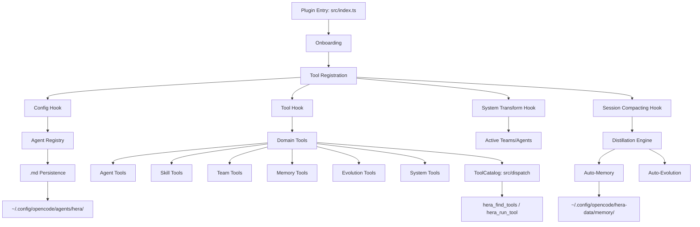

# Hera Architecture

## System Overview



## Module Breakdown

### Core Modules

| Module | File | Responsibility |
|--------|------|---------------|
| **Plugin Entry** | `src/index.ts` | Initializes all systems, registers hooks |
| **Agent Registry** | `src/agents/registry.ts` | CRUD for agent .md files |
| **Hera Agent** | `src/agents/hera.ts` | Default agent definition + 10 templates |
| **Skill Manager** | `src/skills/manager.ts` | Built-in + user skill management |
| **Team Manager** | `src/team/manager.ts` | Team creation + session spawning |
| **Memory Store** | `src/memory/store.ts` | JSON-based persistent storage |
| **Distillation Engine** | `src/distillation/engine.ts` | Extracts knowledge from sessions |

### New Modules (v2.1+)

| Module | File | Responsibility |
|--------|------|---------------|
| **Constants** | `src/constants.ts` | 15 extracted constants |
| **Helpers** | `src/helpers.ts` | Shared utility functions |
| **Persistence** | `src/persistence.ts` | Unified file I/O layer |
| **Logger** | `src/logger.ts` | Debug logging with levels |
| **Validation** | `src/validation.ts` | Agent name validation |
| **Client Types** | `src/types/client.ts` | OpenCodeClient interface |
| **Smart Extractor** | `src/memory/smart-extractor.ts` | Auto-memory from sessions |
| **Auto-Evolve** | `src/evolution/auto-evolve.ts` | Semi-automatic evolution |
| **Team Templates** | `src/team/templates.ts` | Pre-defined team templates |
| **Onboarding** | `src/onboarding.ts` | First-run setup |
| **CLI** | `bin/hera.js` | Command-line interface (Node, reads disk directly) |

### New Modules (v2.2+)

| Module | File | Responsibility |
|--------|------|---------------|
| **Subagent skill** | `src/skills/subagent.ts` | Delegate to specialized agents via hera_spawn_agent |
| **Communicate skill** | `src/skills/communicate.ts` | Team coordination via hera_team_message |
| **Auto-compact skill** | `src/skills/auto-compact.ts` | Context window discipline + memory persistence |
| **Plugin Generator** | `src/generators/plugin-generator.ts` | Generate single-agent OpenCode plugin (skill-manifest prompt, `skills/<name>/SKILL.md` files + namespaced loader, memory tools, evolution log, auto-build) |
| **Team Plugin Generator** | `src/generators/team-plugin-generator.ts` | Generate plugin registering a whole team of agents |
| **Skill→Team Upgrade** | `src/tools/skill-to-team.ts` | Convert N skills into N member agents + a coordinating team |
| **OKR Manager** | `src/team/okr-manager.ts` | OKR-style team management |
| **Tree Manager** | `src/team/tree-manager.ts` | Hierarchy team management |
| **Control Manager** | `src/team/control-manager.ts` | Control-point team management |
| **Test Harness** | `src/tools/test-harness.ts` | Shared PluginContext factory for tool integration tests |

Team management modes are intentionally separate from coordination modes. Coordination (`parallel`, `sequential`, `adaptive`) controls how sessions are spawned. Management (`simple`, `okr`, `tree`, `control`) controls the team's tracking model: flat collaboration, objectives/key results, hierarchy view, or approval checkpoints. Team members also share a blackboard-style workspace through `hera_team_remember` / `hera_team_recall`; message inboxes (`hera_team_message`, `hera_get_team_messages`, `hera_ack_team_messages`) remain separate from durable shared context.

### Progressive Disclosure & Tool Dispatch (`src/dispatch/`)

Agents do not carry all ~75 tool schemas natively. Each agent gets a small **hot set** of natively registered tools (children: `hera_find_tools`, `hera_run_tool`, `hera_load_skill`, `hera_remember`, `hera_recall`; Hera additionally keeps the agent/skill/team domains). Everything else is reachable through the catalog:

| Module | File | Responsibility |
|--------|------|---------------|
| **Tool Catalog** | `src/dispatch/catalog.ts` | In-memory catalog built once at startup; deterministic keyword scoring (name hits > description hits, domain boost); domain browse; catalog primer for prompts |
| **Dispatch Policy** | `src/dispatch/policy.ts` | `checkDispatch()` authorization (agent `tools` map + `disabled_tools`; meta-tools never dispatchable); `buildNativeToolsMap()` per-agent allow/deny map; Hera hot-set computation |
| **Meta-Tools** | `src/dispatch/meta-tools.ts` | `hera_find_tools` (search/browse, policy-filtered results) and `hera_run_tool` (authorize → zod validation → execute passthrough; errors returned as text, never thrown) |

Data flow:

```
createAllTools() ── merged map + domain labels ──▶ ToolCatalog (in memory)
  ├▶ config hook: hot set ∩ policy → per-agent tools allow/deny map
  ├▶ hera_find_tools: search (results pre-filtered by caller's policy)
  └▶ hera_run_tool: policy check → zod validation → execute passthrough
```

Retrieval is in-memory keyword scoring — no embeddings, no SQLite; the catalog is derived from the live tool map at startup and can never go stale. The hot set is a performance knob only: authorization always stays with the agent `tools` map plus `disabled_tools`, and the dispatcher re-enforces both plus argument schema validation, so dispatched calls are exactly as strict as native ones. Fallbacks: putting `hera_find_tools`/`hera_run_tool` in `disabled_tools` reverts every agent to full-native registration; a per-agent `hera_run_tool: false` opts that single agent out the same way.

### Tool Domains (Split from Monolith)

`createAllToolsWithDomains()` in `src/tools/index.ts` merges 14 domain factories and preserves a `name → domain` label map for the catalog:

| Domain | File | Tools |
|--------|------|-------|
| **Agent** | `src/tools/agent-tools.ts` | create_agent (md/plugin), install_agent, uninstall_agent, list, delete, spawn, verify, export, import, list_backups, restore, quickstart |
| **Skill** | `src/tools/skill-tools.ts` | create_skill, list, **load_skill**, delete, analyze, decompose, upgrade_to_agent, **upgrade_to_team** |
| **Team** | `src/tools/team-tools.ts` | create, upgrade_agents_to_team, list, delete, spawn, message, get/ack messages, team_remember/recall, quick_team, set/preview workflow, add_objective, update_key_result, add_control_point, get_team_progress, **export_team** |
| **Memory** | `src/tools/memory-tools.ts` | remember, recall |
| **Evolution** | `src/tools/evolution-tools.ts` | evolve, list_evolutions, rollback, distill_session, propose_evolution |
| **System** | `src/tools/system-tools.ts` | status |
| **Package** | `src/tools/package-tools.ts` | package_agent, unpack_agent, list_packages |
| **Workflow** | `src/tools/workflow-tools.ts` | create, execute, approve, get_status, list, delete |
| **Task** | `src/tools/task-tools.ts` | enqueue_task, enqueue_batch, task_status, list_tasks, cancel_task, batch_report |
| **Loop** | `src/tools/loop-tools.ts` | create_loop, list_loops, loop_status, pause, resume, cancel |
| **Recovery** | `src/tools/recovery-tools.ts` | recover, recover_sessions, engine_health |
| **Program** | `src/tools/program-tools.ts` | run_program |
| **Program Scaffold** | `src/tools/program-scaffold-tools.ts` | create_program_skill |
| **Command** | `src/tools/command-tools.ts` | create_command, list_commands, delete_command |

The two dispatch meta-tools (`hera_find_tools`, `hera_run_tool`) live in `src/dispatch/meta-tools.ts`, outside the 14 domains, and are merged on top of the domain map in `src/index.ts`.

## Data Flow

### Plugin Initialization

```
1. Load hera.json config
2. Check isFirstRun()
3. If first run: runOnboarding() → create default agents/teams
4. Initialize AgentRegistry → load all .md agents
5. Initialize SkillManager → load built-in + user skills
6. Initialize TeamManager → load team definitions
7. Initialize MemoryStore → load memory files
8. Migrate legacy full-body agent .md files to manifest form (one-time, idempotent)
9. Register all tools (14 domains) → build ToolCatalog → add dispatch meta-tools
10. Register hooks (config, tool, system.transform, session.compacting)
    └ config hook: per-agent native tools map = hot set ∩ authorization + catalog primer
```

### Session Compacting Flow

```
1. OpenCode triggers session.compacting hook
2. DistillationEngine.extract() processes messages
3. SmartExtractor.extractMemories() identifies key insights
4. AutoEvolve.analyze() generates evolution proposals
5. Results stored in memory (auto-memory) or presented to user (auto-evolve)
```

### Agent Creation Flow

```
1. User calls hera_create_agent
2. Validation.validateAgentName() checks name
3. AgentRegistry.register() writes .md file
4. persistAgent() saves to disk
5. registeredAgents.set() adds to runtime map
6. Config hook injects into OpenCode
```

### Agent Deletion Flow (Soft Delete)

```
1. User calls hera_delete_agent
2. backupAgent() creates JSON backup
3. removeAgent() deletes .md file
4. registeredAgents.delete() removes from runtime
5. Backup retained in hera-data/backups/
```

## Persistence Layer

All file I/O flows through `src/persistence.ts`:

```
persistAgent()     → writes .md files to agents/hera/
removeAgent()      → deletes .md files (with backup)
backupAgent()      → creates JSON backups in hera-data/backups/
restoreAgent()     → restores from backup
listBackups()      → lists available backups
```

## Testing Strategy

- **Framework**: bun:test (Bun built-in)
- **Approach**: TDD — write tests before implementation
- **Coverage**: 201 tests across 13 files, 81% line coverage
- **Test Files**: `*.test.ts` alongside source files
- **CI**: `bun test` runs all tests

## Configuration

### hera.json Schema

```json
{
  "$schema": "./hera.schema.json",
  "disabled_agents": [],
  "disabled_skills": [],
  "disabled_tools": [],
  "agent_overrides": {},
  "templates": {},
  "auto_evolve": false,
  "memory_limit": 1000,
  "team_defaults": {
    "coordination": "parallel",
    "timeout": 300000
  }
}
```

### Environment Variables

| Variable | Description |
|----------|-------------|
| `HERA_DEBUG` | Enable debug logging |
| `HERA_CONFIG_ROOT` | Canonical override for the OpenCode config root used by the plugin runtime and CLI |
| `OPENCODE_CONFIG_ROOT` | Legacy alias for the config root; read only when `HERA_CONFIG_ROOT` is unset |
| `HERA_DIR` | Config root used **only** by generated standalone-plugin memory helpers (not the main runtime/CLI) |

## Agent Mode Renaming (Documentation Only)

For clarity in documentation, modes are referred to as:
- `primary` → **autonomous** (self-directed agent)
- `subagent` → **task** (task-specific agent)
- `all` → **universal** (flexible agent)

**Note**: Code retains original names for backward compatibility.

## Directory Structure

```
hera-agent/
├── src/
│   ├── index.ts              # Plugin entry
│   ├── onboarding.ts         # First-run setup
│   ├── constants.ts          # Extracted constants
│   ├── helpers.ts            # Shared utilities
│   ├── persistence.ts        # Unified persistence
│   ├── logger.ts             # Debug logging
│   ├── validation.ts         # Name validation
│   ├── types.ts              # Core types
│   ├── types/
│   │   └── client.ts         # OpenCode client types
│   ├── agents/
│   │   ├── hera.ts           # Hera agent + templates
│   │   └── registry.ts       # .md file persistence
│   ├── skills/
│   │   ├── caveman.ts        # Ultra-compressed communication
│   │   ├── init.ts           # Environment awareness
│   │   ├── memory.ts         # Autonomous memory
│   │   ├── evolution.ts      # Self-improvement
│   │   ├── skill-combo.ts    # Skill composition
│   │   ├── subagent.ts       # Delegate to specialized agents
│   │   ├── communicate.ts    # Team coordination via messaging
│   │   ├── auto-compact.ts   # Context window discipline
│   │   ├── analyzer.ts       # Skill capability analysis
│   │   └── manager.ts        # Skill CRUD
│   ├── dispatch/
│   │   ├── catalog.ts        # In-memory ToolCatalog + keyword scoring + primer
│   │   ├── policy.ts         # Dispatch authorization + native-set computation
│   │   └── meta-tools.ts     # hera_find_tools / hera_run_tool
│   ├── generators/
│   │   ├── plugin-generator.ts       # Single-agent plugin export
│   │   └── team-plugin-generator.ts  # Team plugin export
│   ├── tools/
│   │   ├── index.ts          # Tool registration
│   │   ├── agent-tools.ts    # Agent domain
│   │   ├── skill-tools.ts    # Skill domain
│   │   ├── team-tools.ts     # Team domain
│   │   ├── memory-tools.ts   # Memory domain
│   │   ├── evolution-tools.ts # Evolution domain
│   │   ├── system-tools.ts   # System domain
│   │   ├── skill-to-team.ts  # Skill→Team upgrade helper
│   │   └── test-harness.ts   # Shared PluginContext factory for tests
│   ├── team/
│   │   ├── manager.ts        # Team coordination
│   │   ├── templates.ts      # Pre-defined team templates
│   │   ├── okr-manager.ts    # OKR-style management
│   │   ├── tree-manager.ts   # Hierarchy management
│   │   └── control-manager.ts # Control-point management
│   ├── memory/
│   │   ├── store.ts          # JSON persistence
│   │   └── smart-extractor.ts # Auto-memory extraction
│   ├── distillation/
│   │   └── engine.ts         # Knowledge extraction
│   └── evolution/
│       └── auto-evolve.ts    # Semi-automatic evolution
├── bin/
│   └── hera.js               # CLI entry
├── dist/                     # Build output
├── docs/                     # Additional documentation
├── package.json
├── README.md
├── CLAUDE.md
├── ARCHITECTURE.md
└── bunfig.toml               # Test configuration
```

## Performance Characteristics

- **Build Time**: ~25ms (36 modules)
- **Bundle Size**: ~168 KB
- **Test Runtime**: ~9s (429 tests, includes E2E build verification)
- **Line coverage**: ~93%
- **Memory Footprint**: Minimal (lazy-loaded modules)
- **Startup Time**: <100ms (plugin initialization)

## Security Considerations

- All file paths resolved through `resolveConfigRoot()`
- Agent names validated before file operations
- Backups prevent accidental data loss
- No network dependencies (zero external requests)
- Input sanitization on all user-facing tools
