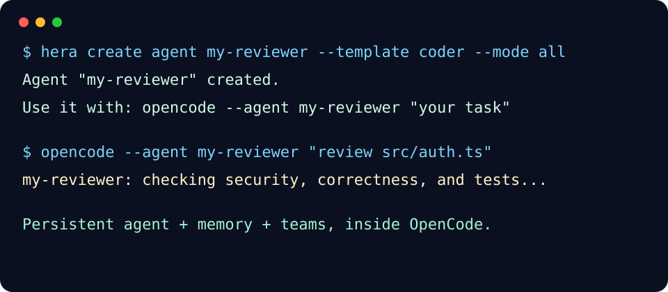

# Hera - Agent Factory for OpenCode

> Stop rebuilding the same AI teammate. Hera turns prompts into persistent OpenCode agents with memory, skills, teams, and exportable plugins.

[](https://github.com/yangyifei123/hera-agent/releases/tag/v2.2.1)
[](LICENSE)
[](https://github.com/opencode-ai/opencode)

**The pain:** every serious AI coding workflow eventually becomes a pile of repeated prompts: reviewer, debugger, tester, architect, release helper.

**The fix:** Hera stores those roles as durable agents you can call again, improve over time, combine into teams, and share as plugins.

**What is OpenCode?** OpenCode is a terminal-first AI coding tool with a plugin system. Hera plugs into that system; it does not replace OpenCode. If you already use OpenCode, Hera is the persistence/team layer it is missing. If you are new, start with [OpenCode](https://github.com/opencode-ai/opencode), then install Hera.



```bash
# 1. Install with npm (recommended; no Bun required)
mkdir -p ~/.config/opencode
npm install --prefix ~/.config/opencode hera-agent

# 2. Create an agent that remembers (CLI path)
node ~/.config/opencode/node_modules/hera-agent/bin/hera.js create agent my-reviewer --template coder --mode all

# 3. Use it - it persists
opencode --agent my-reviewer "review src/auth.ts for security issues"
```

Prefer a guided path? Run:

```bash
node ~/.config/opencode/node_modules/hera-agent/bin/hera.js quickstart
```

## Why Hera?

If you use OpenCode and find yourself re-typing prompt patterns - code review, testing, documentation, debugging - Hera turns those patterns into persistent agents that:

- **Remember** across sessions (shared memory pool)
- **Evolve** by reflecting on past work
- **Coordinate** as teams (parallel, sequential, or DAG workflows)
- **Export** as standalone plugins you can share

No Python service, no API server, no new runtime. Runs inside OpenCode.

See the visual/recording script in [docs/TERMINAL_DEMO.md](docs/TERMINAL_DEMO.md), agent mode guide in [docs/MODES.md](docs/MODES.md), and 10 copy-paste recipes in [docs/SHOWCASE.md](docs/SHOWCASE.md).

## 2-Minute Demo

See [docs/CANONICAL_DEMO.md](docs/CANONICAL_DEMO.md) for the full walkthrough. Quick version:

```bash
# Install Hera (npm path; no Bun required)
mkdir -p ~/.config/opencode
npm install --prefix ~/.config/opencode hera-agent

# Verify
node ~/.config/opencode/node_modules/hera-agent/bin/hera.js doctor
# Expected: All checks passed

# Create a code review team
opencode run --agent hera "create review-team with code-reviewer and bug-hunter, mode: parallel"

# Use the team
opencode run --agent hera "spawn review-team to review src/index.ts"

# Memory persists across sessions
opencode run --agent hera "remember: our project uses 2-space indentation and strict TypeScript"
opencode run --agent hera "recall: coding style"
```

## Features

| Feature | What it does |
|---------|-------------|
| **Agent Factory** | Create agents from 10 templates or custom prompts |
| **Persistent Memory** | All agents share a JSON memory store that survives restarts |
| **Self-Evolution** | Agents reflect on sessions and append improvement directives |
| **Team Coordination** | Parallel, sequential, or DAG execution with real OpenCode sessions |
| **Team Recipes** | Editable step-by-step recipes for team behavior, with preview and override support |
| **Plugin Export** | Agents and teams export as standalone OpenCode plugins |
| **Skill Composition** | 11 built-in skills inherited by every agent |
| **Workflow Engine** | Auto-detects task complexity; proposes workflows for multi-step tasks |
| **Session Distillation** | Extract structured knowledge from conversations |
| **Agent Packaging** | Package/export/import agents with memory as `.tar.gz` |
| **Offline Friendly** | Runtime has zero network dependencies from v2.0+ |

## Quick Start

### Prerequisites

- [OpenCode](https://github.com/opencode-ai/opencode) CLI
- One package manager: npm/Node.js (recommended), Bun, pnpm, or yarn

### Install Options

#### Option A: npm / Node.js (recommended if Bun fails)

```bash
# Linux/macOS
mkdir -p ~/.config/opencode
npm install --prefix ~/.config/opencode hera-agent

# Windows PowerShell
New-Item -ItemType Directory -Force "$env:USERPROFILE\.config\opencode"
npm install --prefix "$env:USERPROFILE\.config\opencode" hera-agent
```

#### Option B: Linux one-shot install

```bash
set -e
mkdir -p ~/.config/opencode
npm install --prefix ~/.config/opencode hera-agent
node ~/.config/opencode/node_modules/hera-agent/bin/hera.js doctor
```

#### Option C: Bun

```bash
# Linux/macOS
cd ~/.config/opencode && bun add hera-agent

# Windows PowerShell
cd $env:USERPROFILE\.config\opencode; bun add hera-agent
```

#### Option D: Manual tarball install (offline/internal networks)

```bash
# On a machine with internet access
npm pack hera-agent

# Copy hera-agent-<version>.tgz to the target machine, then:
mkdir -p ~/.config/opencode
npm install --prefix ~/.config/opencode /path/to/hera-agent-<version>.tgz
```

#### Option E: Manual source install

```bash
git clone https://github.com/yangyifei123/hera-agent.git
cd hera-agent
npm install
npm run build

mkdir -p ~/.config/opencode
npm install --prefix ~/.config/opencode /path/to/hera-agent
```

### Verify

```bash
node ~/.config/opencode/node_modules/hera-agent/bin/hera.js doctor
# Expected: All checks passed

# If installed with Bun, this also works:
bun run ~/.config/opencode/node_modules/hera-agent/bin/hera.js doctor
```

### Create and Use Agents

```bash
# Create from template using the CLI
node ~/.config/opencode/node_modules/hera-agent/bin/hera.js create agent my-dev --template coder --mode all

# Or create naturally through the Hera agent
opencode run --agent hera "create my-reviewer, mode: all, template: reviewer"

# Use it
opencode --agent my-dev "write a fibonacci function in TypeScript"

# Create a team
opencode run --agent hera "create dev-team with architect, coder, and tester, mode: sequential"

# Store knowledge for all agents
opencode run --agent hera "remember: our API follows REST conventions with snake_case fields"
```

> Important: Use `mode: all` or `mode: primary` for agents you want to call directly with `--agent`. Subagent-mode agents are invoked by other agents, not directly.

Need the full decision guide? See [Agent Modes](docs/MODES.md).

## Built-in Skills

Every agent created by Hera inherits these 11 skills:

| Skill | What it does |
|-------|-------------|
| **caveman** | Ultra-compressed communication (~75% token savings) |
| **init** | Auto-detect project context on session start |
| **memory** | Persistent JSON store - remember/recall across sessions |
| **evolution** | Self-improvement through session reflection |
| **skill-combo** | Chain multiple skills on-the-fly |
| **subagent** | Delegate sub-tasks to specialized agents |
| **communicate** | Message passing between team members |
| **auto-compact** | Automatic context window compression |
| **workflow-orchestration** | Plan and coordinate multi-step workflows |
| **brainstorming** | Explore requirements before implementation |
| **skill-creator** | Create and refine reusable skills |

## Skill Upgrade Workflows

Hera can turn reusable skills into persistent agents or teams. Use `dry_run: true` first when you want a preview without writing files.

```bash
# Inspect a skill before conversion
opencode run --agent hera "analyze skill security"

# Preview skill -> agent
opencode run --agent hera "upgrade skill security to agent security-reviewer, dry_run: true"

# Create the agent after reviewing the preview
opencode run --agent hera "upgrade skill security to agent security-reviewer, mode: all"

# Preview skill -> team; each skill becomes one member agent
opencode run --agent hera "upgrade skills security, perf to team audit-team, coordination: parallel, management: control, dry_run: true"
```

Upgrade previews show the member agent names Hera would create, inherited default skills, management mode, and naming conflicts before anything is persisted. If a generated member name already exists, Hera rejects the upgrade and suggests an alternative name.

## Team Management Modes and Workspace

Coordination controls execution order: `parallel`, `sequential`, or `adaptive`. Management controls how a team tracks work:

| Management | Meaning |
|------------|---------|
| `simple` | Flat team with no required tracking; members coordinate freely. |
| `okr` | Objectives and key results for progress tracking. |
| `tree` | Hierarchical delegation view: root member delegates, workers report upward. |
| `control` | Approval checkpoints/gates for review-heavy work. |

All teams also have a shared workspace, or blackboard. Members send direct/broadcast messages with `hera_team_message`, read them with `hera_get_team_messages`, acknowledge handled messages with `hera_ack_team_messages`, and publish durable shared context with `hera_team_remember` / `hera_team_recall`.

## Team Workflow Recipes

Each team can carry one editable workflow recipe. A recipe is a small step list that users can preview, save, and modify without learning the internal workflow engine.

```bash
# Create a team with a recipe
opencode run --agent hera "create review-team with my-reviewer and bug-hunter, mode: parallel, workflow: recipe"

# Update the recipe later
opencode run --agent hera "set team review-team workflow: recipe"

# Preview before saving
opencode run --agent hera "preview team workflow: recipe"
```

The quick team templates now include starter recipes, and you can override them when you create or upgrade a team.

## Agent Templates

| Template | Mode | Use for |
|----------|------|---------|
| **general** | all | Versatile assistant |
| **coder** | all | Coding with skill-combo |
| **reviewer** | subagent | Code review |
| **researcher** | subagent | Research and analysis |
| **coordinator** | all | Team coordination |
| **architect** | all | System design |
| **debugger** | all | Debugging |
| **tester** | subagent | Testing |
| **documenter** | subagent | Documentation |
| **optimizer** | subagent | Performance optimization |

## Workflow System

Hera still auto-detects complex tasks and proposes workflows for task execution. Team recipes are a separate, simpler layer for team behavior:

```bash
# Simple task - executes directly
opencode run --agent hera "fix typo in README"

# Complex task - proposes workflow with approval
opencode run --agent hera "refactor auth, add OAuth, write tests, update docs"
```

**Modes**: Serial (sequential), Parallel (concurrent), DAG (dependencies).

See [Workflow Templates](#workflow-templates) for 10 pre-defined templates.

## Agent Packaging & Migration

```bash
# Package agent with memory
opencode run --agent hera "package my-dev agent with memory"

# Export as plugin for distribution
opencode run --agent hera "export my-dev as plugin"

# Import on another machine
opencode run --agent hera "unpack agent from /path/to/my-dev-package.tar.gz"
```

## Configuration

Hera creates `~/.config/opencode/hera.json` on first load:

```json
{
  "disabled_agents": [],
  "disabled_skills": [],
  "agent_overrides": {
    "architect": { "model": "cherry/glm-5.1", "temperature": 0.3 }
  },
  "auto_evolve": false,
  "memory_limit": 1000,
  "team_defaults": { "coordination": "parallel", "timeout": 300000 }
}
```

## Troubleshooting

| Issue | Solution |
|-------|----------|
| `bun: command not found` | Use the npm path: `npm install --prefix ~/.config/opencode hera-agent` |
| `npm: command not found` | Install Node.js LTS, then retry Option A |
| `opencode: command not found` | Install from [opencode-ai/opencode](https://github.com/opencode-ai/opencode), ensure `opencode` is on PATH, then rerun `node ~/.config/opencode/node_modules/hera-agent/bin/hera.js doctor` |
| Hera not appearing | Restart OpenCode or run `opencode agent reload` |
| Agent says "not found" | Create with `mode: "all"`, not `mode: "subagent"` |
| `fetch() cannot be empty string` | Upgrade to v2.0+ (zero network deps) |

## Documentation

- [Installation Guide](docs/INSTALLATION.md) - online/offline/internal networks
- [Installation Risk Matrix](docs/INSTALLATION_RISK_MATRIX.md) - install failure modes and plugin boundary
- [Installation Matrix](docs/INSTALLATION_MATRIX.md) - verified install smoke-test results
- [Canonical Demo](docs/CANONICAL_DEMO.md) - 2-minute walkthrough
- [Architecture](ARCHITECTURE.md) - deep dive
- [Changelog](CHANGELOG.md) - version history
- [Contributing](CONTRIBUTING.md) - how to contribute

## CLI Reference

```bash
hera doctor           # Health check
hera list agents      # List agents
hera list skills      # List skills
hera list teams       # List teams
hera create agent NAME --template coder  # Create agent
hera quickstart       # Create starter agent + show next steps
hera status           # System status
hera version          # Show version
```

When installed with `npm install --prefix ~/.config/opencode`, the `hera` binary may not be on PATH. The always-correct form is:

```bash
node ~/.config/opencode/node_modules/hera-agent/bin/hera.js doctor
```

Windows PowerShell:

```powershell
node "$env:USERPROFILE\.config\opencode\node_modules\hera-agent\bin\hera.js" doctor
```

See [Tool Reference](#tool-reference) for all 75 management tools across 14 domains.

---

## Tool Reference

<details>
<summary><strong>Agent Management</strong></summary>

- `hera_create_agent` - Create agent (optionally from template)
- `hera_list_agents` - List all created agents
- `hera_delete_agent` - Remove an agent (with backup)
- `hera_restore_agent` - Restore agent from backup
- `hera_spawn_agent` - Spawn agent as real OpenCode session
- `hera_verify_agent` - Verify agent registration
- `hera_export_agent` - Export agent as JSON
- `hera_import_agent` - Import agent from JSON
- `hera_quickstart` - Guided wizard for first-time setup

</details>

<details>
<summary><strong>Skill Management</strong></summary>

- `hera_create_skill` - Create a reusable skill
- `hera_list_skills` - List all skills
- `hera_delete_skill` - Delete a user-created skill
- `hera_upgrade_to_agent` - Upgrade skills into a full agent; supports `dry_run` preview
- `hera_upgrade_to_team` - Upgrade skills into a coordinated agent team; supports `dry_run` preview

</details>

<details>
<summary><strong>Team Management</strong></summary>

- `hera_create_team` - Create team with members and coordination mode
- `hera_upgrade_agents_to_team` - Convert existing agents into a team
- `hera_list_teams` - List all teams
- `hera_delete_team` - Remove a team
- `hera_spawn_team` - Launch team task
- `hera_team_message` - Send message between team members
- `hera_get_team_messages` - Read queued team messages for a member
- `hera_ack_team_messages` - Mark handled team messages as acknowledged
- `hera_team_remember` - Write to the team's shared workspace / blackboard
- `hera_team_recall` - Read from the team's shared workspace / blackboard
- `hera_quick_team` - Create team from template

</details>

<details>
<summary><strong>Memory & Evolution</strong></summary>

- `hera_remember` - Store information in persistent memory
- `hera_recall` - Search persistent memory
- `hera_evolve_agent` - Append evolution directive to agent
- `hera_list_evolutions` - View agent evolution history
- `hera_rollback_evolution` - Rollback latest evolution
- `hera_distill_session` - Extract knowledge from session

</details>

<details>
<summary><strong>System Management</strong></summary>

- `hera_status` - Show system status (agents, skills, teams, memory)

If onboarding needs to be re-run manually, delete `hera-data/.onboarded` under the OpenCode config root and restart OpenCode; there is no `hera_onboard` tool.

</details>

<details>
<summary><strong>Task Engine</strong></summary>

- `hera_enqueue_task` - Enqueue a background task for the engine to execute
- `hera_task_status` - Get the status/result of a queued or running task
- `hera_list_tasks` - List background tasks
- `hera_cancel_task` - Cancel a queued or running task
- `hera_enqueue_batch` - Enqueue a batch of related tasks
- `hera_batch_report` - Get a combined status report for a batch

</details>

<details>
<summary><strong>Loop Engine</strong></summary>

- `hera_create_loop` - Create a recurring/looping background task
- `hera_list_loops` - List all loops
- `hera_loop_status` - Get the status of a loop
- `hera_pause_loop` - Pause a running loop
- `hera_resume_loop` - Resume a paused loop
- `hera_cancel_loop` - Cancel a loop

</details>

<details>
<summary><strong>Recovery</strong></summary>

- `hera_recover` - Recover in-flight background work after a crash/restart
- `hera_recover_sessions` - Recover orphaned OpenCode sessions
- `hera_engine_health` - Report background engine health

</details>

<details>
<summary><strong>Package Management</strong></summary>

- `hera_package_agent` - Package an agent (optionally with memory) as a `.tar.gz` archive
- `hera_unpack_agent` - Unpack and install an agent package
- `hera_list_packages` - List packaged agent archives

</details>

<details>
<summary><strong>Workflow</strong></summary>

- `hera_create_workflow` - Create a generic serial/parallel/DAG workflow definition
- `hera_execute_workflow` - Execute a workflow definition
- `hera_get_workflow_status` - Get the status of a workflow execution
- `hera_list_workflows` - List workflow definitions
- `hera_approve_workflow` - Approve a workflow awaiting an approval step
- `hera_delete_workflow` - Remove a workflow definition

</details>

<details>
<summary><strong>Program Skills</strong></summary>

- `hera_run_program` - Run a program-led skill (ships a `run.ts`) in a sandboxed child process
- `hera_create_program_skill` - Scaffold a new program-led skill (`SKILL.json` + `run.ts` + typings)

</details>

<details>
<summary><strong>Native Commands</strong></summary>

- `hera_create_command` - Create a native OpenCode slash command
- `hera_list_commands` - List native commands
- `hera_delete_command` - Delete a native command

</details>

<details>
<summary><strong>Workflow Templates</strong></summary>

| Template | Mode | Description |
|----------|------|-------------|
| coder-workflow | Serial | Analyze -> Implement -> Test -> Review -> Approve |
| reviewer-workflow | Parallel | Style + Security + Logic + Coverage checks |
| tester-workflow | Serial | Unit -> Integration -> E2E -> Report |
| documenter-workflow | Serial | Analyze -> Write -> Review -> Approve |
| team-workflow | DAG | Plan -> (Dev + Test + Docs) -> Review -> Approve |
| architect-workflow | Serial | Research -> Design -> Review -> Document -> Approve |
| debugger-workflow | Serial | Reproduce -> Analyze -> Fix -> Verify |
| optimizer-workflow | Serial | Profile -> Identify -> Optimize -> Benchmark -> Validate |
| researcher-workflow | Serial | Gather -> Analyze -> Synthesize -> Document |
| general-workflow | Serial | Analyze -> Execute -> Verify -> Report |

</details>

<details>
<summary><strong>Update / Uninstall</strong></summary>

**Update with npm**:
```bash
cd ~/.config/opencode && npm update hera-agent
# Restart OpenCode after update
```

**Update with Bun**:
```bash
cd ~/.config/opencode && bun update hera-agent
# Restart OpenCode after update
```

**Uninstall (keep data)**:
```bash
cd ~/.config/opencode && npm uninstall hera-agent
# Remove "hera-agent" from opencode.json plugin array if needed
```

**Full uninstall (remove everything; confirmation required)**:
```bash
hera uninstall --run --purge --yes
# or manually:
cd ~/.config/opencode && npm uninstall hera-agent
rm -rf ~/.config/opencode/hera-data/ ~/.config/opencode/agents/hera/ ~/.config/opencode/hera.json
```

</details>

## License

MIT

---

**Current Version**: v2.2.1 | **License**: MIT | **Status**: Production Ready
